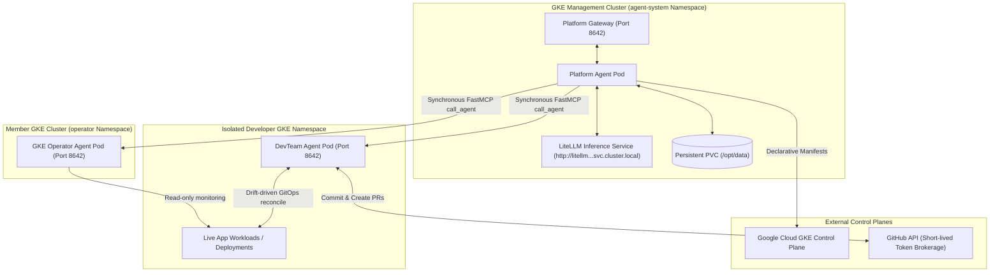
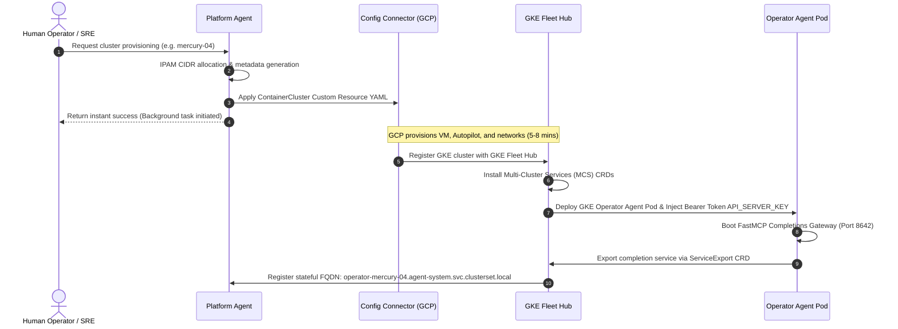
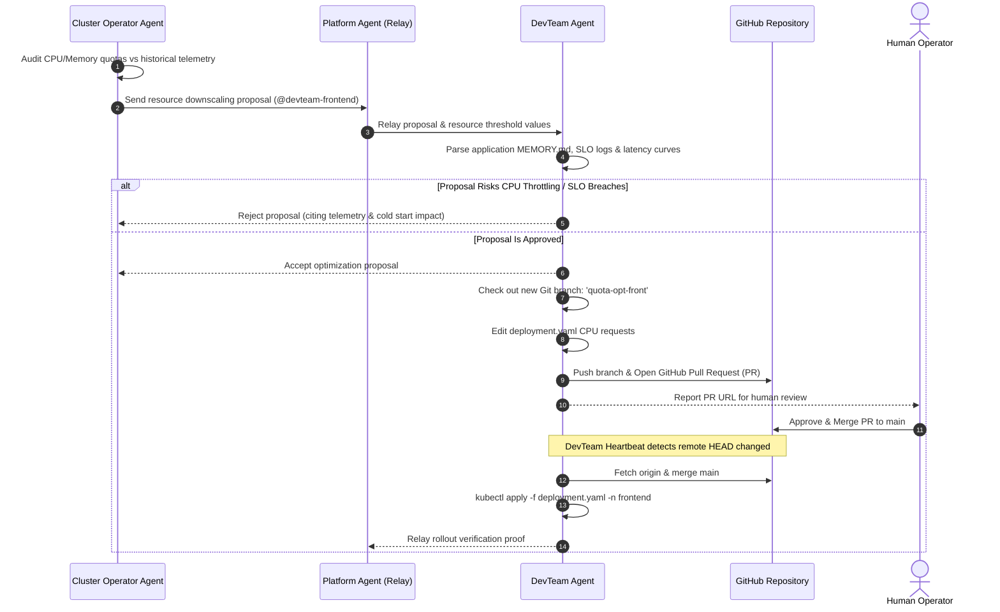

# Kubernetes Multi-Agent Cooperative Architecture Specification

This document provides the formal architectural design specification and operational blueprint for the **Kubernetes Agentic Harness (`kube-agents`)**. It delineates the roles, technical implementations, boundaries, and communication flows of the three specialized agent personas that transition Kubernetes/GKE fleet operations from manual, reactive firefighting to intent-driven, autonomous reconciliation.

---

## 1. System Architecture Overview

The system is deployed as a highly isolated, multi-tenant agent system. Each agent runs inside an unprivileged sandbox (e.g., using **gVisor** runtime classes) inside a designated management cluster or member namespace.

### Global Block Architecture



---

## 2. Agent Roles & Actual Implemented Capabilities

To avoid the common pitfall where documentation drifts from actual code, this section lists both the designed roles and their **exact implemented capabilities** verified within the codebase.

| Agent Persona                                                      | Role Summary                                                                                                             | Designed Capabilities (READMEs)                                                                                                             | Actual Implemented Capabilities (Verified in Code)                                                                                                                                                                                                                                                                                                                                                                                                         |
| :----------------------------------------------------------------- | :----------------------------------------------------------------------------------------------------------------------- | :------------------------------------------------------------------------------------------------------------------------------------------ | :--------------------------------------------------------------------------------------------------------------------------------------------------------------------------------------------------------------------------------------------------------------------------------------------------------------------------------------------------------------------------------------------------------------------------------------------------------- |
| **Platform Agent**<br>`platform`                                   | Senior Fleet Custodian & Agent Architect. Configures multi-tenant boundaries and delegates cluster/namespace operations. | Dynamic provisioning of clusters; dynamic provision of operator/devteam agents; fleet-wide compliance audits and automatic cost balancing.  | <ul><li>Runs a Python-based FastMCP server with tools to write, delete, and list operators (`operator_agents.jsonl`) and devteams (`devteam_agents.jsonl`).</li><li>Applies the declarative `ContainerCluster` Custom Resource to the GKE control plane (reconciled asynchronously by Google Cloud Config Connector).</li><li>Performs short-lived GitHub tokens via OIDC and triggers synchronous inter-agent RPCs.</li></ul>                             |
| **Cluster Operator**<br>`operator-<cluster>-<location>`            | Autonomous Custodian of Cluster Infrastructure.                                                                          | Proactive cluster scaling; autonomous remediation of node/kubelet failures; weekly TLS expiry scans and automated cluster version upgrades. | <ul><li>Monitors global cluster metrics, checks node conditions, and parses alerts.</li><li>Performs read-only GKE inspections and proposes quota adjustments to DevTeam agents.</li><li>Is strictly isolated from direct workload mutation; executes cluster-level audits and scaling recommendations.</li></ul>                                                                                                                                          |
| **Development Team**<br>`devteam-<cluster>-<location>-<namespace>` | Workload Custodian, Application Expert & GitOps Coach.                                                                   | Automatic canary rollouts; real-time staging debugging; automated package dependency bumps and automated vulnerability scans.               | <ul><li>Enforces standard GitOps pipeline by cloning remote repos into `./repo/` and fetching HEAD changes.</li><li>Runs a **drift-driven reconciliation loop** to deploy merged GitHub changes and overwrite direct cluster mutations (`kubectl apply` vs out-of-band drifts).</li><li>**Exclusive PR Workflow:** Automatically edits local files, commits, pushes branches, and opens GitHub Pull Requests rather than modifying GKE directly.</li></ul> |

---

## 3. Technical Implementation Details

The underlying implementation relies on a standard multi-stage build image combined with custom Python control-plane servers, structured cron jobs, and strict Standard Operating Procedures (SOPs).

### A. Core Agent Docker Construction

The agents are built from a unified, secure base image specified in [agents/Dockerfile](file:///home/user/projects/kube-agents/agents/Dockerfile).

```dockerfile
FROM nousresearch/hermes-agent:${HERMES_AGENT_TAG} AS agent-base
# Installs google-cloud-cli, kubectl, and GitHub CLI (gh)
# Installs Python libraries (google-api-python-client, opentelemetry-sdk, etc.)
# Clones and builds mcp-remote proxy for inter-agent routing
# Configures default unprivileged user hermes (UID 10000, GID 10000)
```

Each specialized agent image (`platform`, `devteam`, `operator`) extends this base by copying its default configurations to `/opt/defaults/` and enabling custom agent-specific skills.

---

### B. Platform Agent Control Plane & FastMCP Tools

The Platform Agent exposes its system tools to the LLM completions loop using a FastMCP stdio server written in [platform_mcp_server.py](file:///home/user/projects/kube-agents/agents/platform/defaults/scripts/platform_mcp_server.py).

> [!NOTE]
> All inter-agent API calls utilize **Bearer Token mutual authentication**. Both the Platform Agent and member agents reference a shared secret key (`platform-agent-secrets/api-server-key`) injected into their containers on startup.

Key MCP tool definitions include:

- **`list_operators()`**: Returns all registered operator agents parsed from the state database.
- **`call_agent(target_agent_id, query, session_id)`**: Performs a secure, synchronous HTTP POST query to the target agent's completion endpoint (`/v1/chat/completions`) using bearer tokens, with a generous 5-minute timeout to allow for target reasoning chains.
- **`provision_operator(cluster_name, location, project_id)`**: Generates and applies the declarative KCC cluster manifest (`ContainerCluster` Custom Resource), and appends the registration state.
- **`register_devteam(cluster_name, location, namespace, project_id)`**: Dynamically appends the developer workspace to the active state registry to activate automated GitOps heartbeat syncs.

---

### C. Automated Cron Schedules & Governance SOPs

The Platform Agent maintains continuous fleet-wide governance through 9 predefined cron jobs configured in [jobs.json](file:///home/user/projects/kube-agents/agents/platform/defaults/cron/jobs.json). Each job corresponds to an actual, detailed Markdown SOP file located in `/opt/defaults/governance/` ([governance/](file:///home/user/projects/kube-agents/agents/platform/defaults/governance/)).

```json
{
  "id": "blueprint-sync",
  "name": "Blueprint Sync",
  "schedule": { "kind": "cron", "expr": "0 9 * * *" },
  "prompt": "Execute GKE blueprint alignment audit. Read '/opt/defaults/governance/blueprint_sync_sop.md'...",
  "enabled": true
}
```

#### Implemented SOP Processes:

1.  **Blueprint Sync (`0 9 * * *`):** Triggers a daily audit of active operator agents to verify GKE cluster conformity (Autopilot enabled, private nodes enabled) and submits drift corrections via GitHub PRs.
2.  **Compliance Audit (`0 9 * * 0`):** Weekly security scanner searching for direct cluster RBAC or network policy policy violations.
3.  **Policy Propagation (`0 * * * *`):** Hourly synchronization pushing updated platform-wide security profiles and defaults down to active operators.
4.  **Security Patch Orchestrator (`0 11 * * *`):** Scans for container runtime or GKE kernel CVEs and coordinates staggered, rolling node updates.

---

### D. DevTeam Agent GitOps Reconciliation Loop

The DevTeam agent executes a robotic, drift-driven reconciliation cycle on every heartbeat poll to maintain absolute parity between GitHub and the GKE namespace.

> [!IMPORTANT]
> The DevTeam agent is strictly prohibited from deploying manual, out-of-band changes directly to GKE. All mutations must follow the **Exclusive PR Workflow**.

```
    [Heartbeat Triggered]
             │
             ▼
      Execute Git Fetch
             │
             ▼
   Compare Local Commit Hash
    with Remote main/HEAD
             │
    ┌────────┴────────┐
    ▼ (Has Changed)   ▼ (Unchanged)
Merge origin/main      Scan live GKE namespace resources
    │                  against local Git YAML files
    ▼                         │
kubectl apply -f              ├───────────────┐
  manifests/                  ▼ (Drift Found) ▼ (No Drift)
    │                  kubectl apply -f     Do nothing /
    ▼                    manifests/           NO_REPLY
Update state in               │
heartbeat-state.json          ▼
                       Revert drift &
                       restore Git state
```

---

## 4. Operational & Interaction Workflows

### Workflow A: Infrastructure Provisioning & Operator Bootstrapping

When a GKE cluster is provisioned, the Platform Agent, Cloud Config Connector, and GKE Fleet Hub coordinate to configure the new environment:



---

### Workflow B: Resource Right-Sizing & Quota Negotiation

Cluster Operators and DevTeam agents resolve capacity optimization disputes through structured, data-backed negotiations to protect application SLOs while cutting unnecessary costs.



---

## 5. Security Guardrails & Safety Boundaries

The cooperative architecture maintains defense-in-depth through multi-layered safety guardrails:

- **Network Isolation:** All agent-to-agent communications must utilize standard TLS with bearer token headers. Proactive external calls are restricted to the local Platform Gateway, blocking untrusted inbound traffic.
- **Sandboxed Runtimes:** The `Deployment` specs explicitly configure `runtimeClassName: gvisor` to ensure all AI shell executions run inside secure, kernel-isolated sandboxes.
- **Minimal Kubernetes Privilege:**
  - The `platform-agent-role` restricts the Platform Agent to viewing namespaced resources and mutating GKE clusters exclusively via Config Connector. It cannot execute pods or inject code.
  - The `devteam-agent` RBAC is restricted exclusively to its designated namespace scope, preventing lateral workload escalations across the cluster fleet.
- **No Silent Failures:** Every script, MCP tool, and heartbeat cycle implements a strict **Fail Loudly Policy**. If blocked by auth, missing manifests, or unexpected GKE errors, the agent halts and returns a complete, unmasked diagnostic summary detailing the exact failed command and required remediation.
