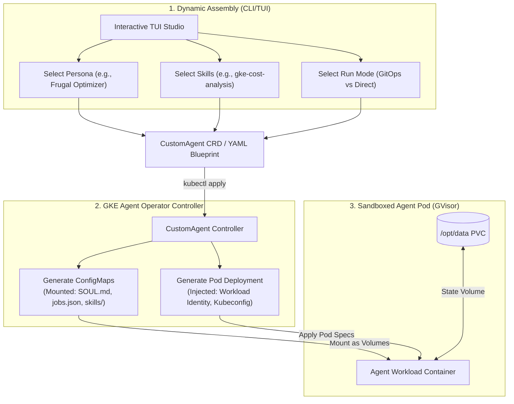
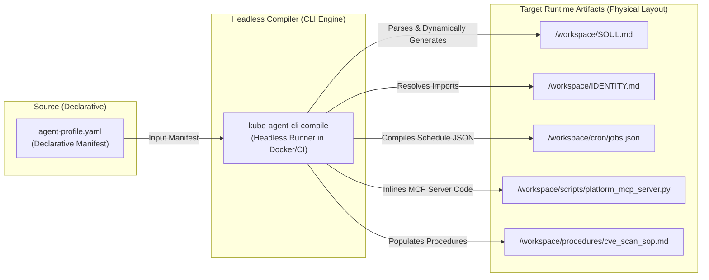
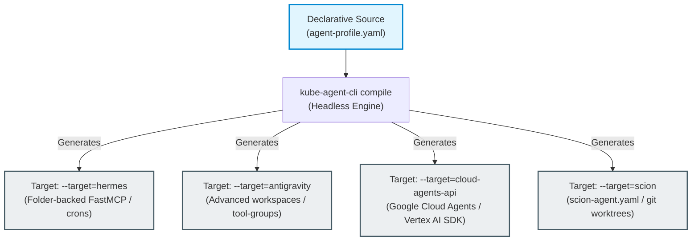

# GKE Agent Blueprints & Dynamic Assembly Specification

This document presents the architectural design for the **GKE Agent Blueprints & Dynamic Assembly Engine**. It details how we can structurally reorganize the `kube-agents` repository to transition from a rigid three-role layout into a fully composable, modular framework.

By utilizing our Go-based **Kubernetes Agent Operator** (`k8s-operator/`) and a proposed Go-based **Interactive CLI/TUI Agent Builder** (leveraging `bubbletea`), administrators and application teams can dynamically assemble, configure, and deploy highly specialized custom agent profiles on-the-fly.

---

## 1. Modular Repository Architecture

To achieve absolute flexibility, we decouple agent configurations into four distinct modular building blocks: **Personas**, **Skills**, **Procedures**, and **Schedules**. These components are mixed and matched dynamically by the CLI/TUI or the GKE Operator to compile a custom agent profile.

```
kube-agents/
├── k8s-operator/               # Go-based Kubernetes Agent Operator (Kubebuilder)
│   ├── api/v1alpha1/           # CRD Schemas (PlatformAgent, DevTeamAgent, OperatorAgent, CustomAgent)
│   └── internal/controller/    # Reconcilers deploying compiled ConfigMaps and Deployments
├── cli/                        # Go-based CLI/TUI Agent Builder (Bubble Tea)
│   ├── main.go                 # CLI/TUI entrypoint
│   └── pkg/tui/                # Interactive wizard components
├── personas/                   # Reusable SOUL.md & IDENTITY.md files (Aesthetics, tone, role focus)
│   ├── standard-operator/
│   ├── paranoid-security-auditor/
│   └── frugal-cost-optimizer/
├── skills/                     # Composable executable tools (MCP scripts, CLI wrappers, YAML modifiers)
│   ├── gke-cost-analysis/
│   ├── gke-workload-security/
│   └── gke-observability/
├── procedures/                 # Standard Operating Procedures (SOPs / markdown-driven reasoning guides)
│   ├── cve_scan_sop.md
│   └── weekly_cost_report_sop.md
└── templates/                  # Seed configs / default blueprints for one-click compilation
    ├── platform/
    ├── operator/
    └── devteam/
```

---

## 2. Dynamic Assembly Engine Design

Instead of deploying a container with a pre-baked, hardcoded persona, the Go operator and CLI-TUI compile an **Agent Profile Manifest**. The Kubernetes operator then dynamically provisions the agent Pod by mounting the selected blocks using a series of unified ConfigMaps and Secrets.



---

## 3. Resolving the 5 Friction Points via Native Dynamic Assembly

This dynamic blueprint model solves each of our core architectural bottlenecks natively inside the Kubernetes control plane:

### A. Persona & Role Rigidity $\rightarrow$ Composable Blueprints

Administrators can define a new agent role simply by creating a standard Kubernetes Custom Resource. The custom operator merges the selected Persona, Skills, and Procedures at startup:

```yaml
apiVersion: agent.gke.io/v1alpha1
kind: CustomAgent
metadata:
  name: cluster-cost-optimizer
  namespace: agent-system
spec:
  # 1. Base Identity
  personaRef:
    name: frugal-cost-optimizer
  # 2. Selectable Capabilities
  skills:
    - name: gke-cost-analysis
    - name: gke-compute-class-creator
  # 3. Attached Governance Procedures
  procedures:
    - name: weekly_cost_report_sop.md
  # 4. Target Operational Boundaries
  namespaces:
    - "app-frontend"
    - "app-backend"
  model:
    provider: "gemini"
    default: "gemini-1.5-pro"
```

---

### B. Monolithic Coupling $\rightarrow$ Isolated Standalone Manifests

Because each compiled blueprint is fully declared within its own namespaced CRD, any agent (e.g., `CustomAgent`, `DevTeamAgent`, `OperatorAgent`) can be deployed **standalone**. An SRE can deploy a single specialized cost-optimization agent in a target namespace without needing to spin up a centralized Platform Agent, Mesh Gateway, or LiteLLM service cluster.

---

### C. Restrictive Namespace Boundaries $\rightarrow$ Dynamic RBAC Injection

The Kubernetes Go Operator handles multi-namespace permissions dynamically. Based on the target `spec.namespaces` list defined in the agent's blueprint:

1. The operator automatically provisions a namespaced `ServiceAccount`.
2. It dynamically applies a `Role` and `RoleBinding` in _each_ target namespace (or a cluster-wide `ClusterRoleBinding` if wide scope is specified) granting minimal required RBAC to the agent's ServiceAccount.
3. The agent is instantly equipped to transition fluidly between namespaces without duplicate container deployments.

---

### D. GitOps Rigidity $\rightarrow$ Configurable Run Modes

We introduce a **Workflow Mode** attribute in the Agent Blueprint spec:

```yaml
spec:
  workflowMode: "Hybrid" # Options: GitOps, Direct, Hybrid
```

- **GitOps (Pure Declarative):** The agent runs its exclusive Pull Request workflow, pushing branches and opening PRs.
- **Direct (Break-Glass Override):** The agent runs with direct `kubectl apply` mutations, printing a distinct `[BREAK-GLASS]` flag and streaming fail-loud reconciliation audit logs to Cloud Logging.
- **Hybrid (Interactive Gate):** The agent prepares direct mutations, writes state to `.gemini-status.json` as `WAITING_FOR_APPROVAL`, and sends a notification with a diff-preview. The SRE can approve the change with a single CLI/TUI command (`kube-agent-cli approve <agent-name>`) to let the agent apply the change directly.

---

### E. Heavy Waking Costs $\rightarrow$ Local Pre-flight Screening Gates

Each skill block integrates a fast, non-cognitive **Pre-flight Screening Hook** (written in bash or Go). The agent container's cron engine runs this script first before waking the LLM:

```bash
#!/bin/bash
# Pre-flight Hook: skills/gke-cost-analysis/preflight.sh
# Performs rapid, non-cognitive cluster quota vs usage scan

drift_found=$(kubectl get deployment -n app-frontend -o json | jq -r '...detect_overprovisioning...')

if [ "$drift_found" = "false" ]; then
  # No actions needed. Exit silently without calling the LLM.
  exit 0
else
  # Out-of-sync or optimization found! Exit with code 1 to activate the cognitive completion.
  echo "OVERPROVISIONING_METRICS: $drift_found"
  exit 1
fi
```

- **Impact:** Reduces API billing costs by up to **90%** by keeping the LLM idle unless cognitive reasoning is strictly required.

---

## 4. Designing the Bubble Tea Interactive TUI Builder

To allow developers to assemble agent profiles with ease, we propose a Go-based **TUI Studio** (`kube-agent-cli`) built using the `bubbletea` framework. This interactive CLI provides a premium terminal-based wizard interface.

```
┌────────────────────────────────────────────────────────────────────────┐
│                      GKE AGENT ASSEMBLY STUDIO                         │
├────────────────────────────────────────────────────────────────────────┤
│                                                                        │
│  [1] Choose Persona Archetype                                          │
│      ○ Standard Operator (Calm, analytical infrastructure auditor)      │
│      ● Paranoid Security Auditor (Strict RBAC, networking scanner)     │
│      ○ Frugal Cost Optimizer (Resource right-sizing expert)            │
│                                                                        │
│  [2] Select Skills (Space to select)                                   │
│      [ ] gke-cost-analysis                                             │
│      [X] gke-workload-security                                         │
│      [X] gke-observability                                             │
│                                                                        │
│  [3] Set Target Scope                                                  │
│      Namespaces: app-frontend, app-backend, security-sandbox           │
│                                                                        │
│  [4] Select Workflow Mode                                              │
│      ● Hybrid (Approve direct mutations via TUI)                       │
│      ○ GitOps (Pull-Request only workflow)                             │
│      ○ Direct (Break-Glass immediate apply)                            │
│                                                                        │
├────────────────────────────────────────────────────────────────────────┤
│  [Enter] Compile Blueprint   [q] Exit Studio   [Tab] Next Section      │
└────────────────────────────────────────────────────────────────────────┘
```

### Core TUI Features:

- **Dynamic Checklist Renderer:** Reads the local `skills/` and `personas/` directories in real-time to populate the TUI selection menus.
- **Blueprint Compiler:** Merges the selected components into a clean Kubernetes Manifest (`CustomAgent` CRD).
- **One-Click Deployment Hub:** Integrates with the local `Kubeconfig` context, letting users deploy the compiled agent to the GKE cluster directly from the terminal with a single stroke.
- **Interactive Status Monitor:** Streams real-time updates from `.gemini-status.json` and allows humans to approve pending actions (`WAITING_FOR_APPROVAL`) using the TUI interface.

---

---

## 5. Declarative Agent Source Profile (DASP) & Headless Compilation

To enable git-ops-friendly, automated, and deterministic provisioning across multiple delivery platforms, we establish the **Declarative Agent Source Profile (DASP)**.

Rather than maintaining fragile physical folder structures in source control, a GKE operations agent is declared entirely inside a single unified `agent-profile.yaml` file. The `kube-agent-cli` is then executed in a **headless manner** (within a Docker image, CI/CD pipeline, or Kustomize generator) to translate this declarative YAML manifest into the exact physical folder and file structure required at runtime.

### A. The DASP Compilation Flow



---

### B. The `agent-profile.yaml` Schema Specification

The DASP schema defines the entire agent workspace, bringing together markdown descriptions, executable cron actions, local procedures, and MCP servers into a single declarative template.

#### The Polymorphic Reference Model

To keep YAML manifests clean and highly reusable, **every content-bearing node** in the schema (`soul`, `identity`, `procedures`, `mcp_servers`, and `scripts`) supports a polymorphic format. You can define content in two ways:

1.  **Direct Inlining:** Using a YAML block-string (`|`) or an inline `content:` parameter. This is ideal for short, specialized scripts, configs, or rapid prototyping.
2.  **File Referencing (`ref`):** Supplying a `ref` path pointing to an external file (e.g., `ref: "./personas/frugal-cost-optimizer/SOUL.md"`). During compilation, the headless CLI resolves these relative paths and pulls the content in, promoting absolute reusability of Markdown SOPs, shell scripts, and python logic across different agents.

```yaml
# agent-profile.yaml
schema_version: "v1alpha1"
metadata:
  name: "frugal-cost-optimizer"
  version: "1.2.0"
  description: "Dynamic cost analyzer for multi-tenant GKE clusters"

# 1. Core Identity & Prompt Configuration (Polymorphic: Inlined or Referenced)
identity:
  # Referenced external Markdown file (keeps YAML clean and reusable)
  soul:
    ref: "./personas/frugal-cost-optimizer/SOUL.md"
  # Inlined directly in the YAML
  identity: |
    # IDENTITY.md (Inlined)
    Identity: Cost-Optimizer-Agent-01
    Primary Directives: Maximize cluster resource efficiency, audit KCC ContainerCluster metrics.

# 2. Composable Procedures / Guidance Guides
procedures:
  - name: "weekly_cost_report_sop.md"
    ref: "./procedures/gke_cost_analysis_sop.md" # Referenced external file
  - name: "emergency_scaling_sop.md"
    content: |
      # Emergency Scaling SOP (Inlined)
      1. Inspect HPA thresholds via `kubectl get hpa`.
      2. If target namespace utilization exceeds 85%, request immediate quota hike.

# 3. Composable Scripts & MCP Servers
skills:
  - name: "gke-cost-analysis"
    mcp_servers:
      - name: "cost_mcp_server.py"
        runtime: "python3"
        content: |
          # cost_mcp_server.py (Inlined fastmcp server)
          from mcp.server.fastmcp import FastMCP
          mcp = FastMCP("Cost Optimizer")

          @mcp.tool()
          def get_cluster_idle_costs(cluster_id: str) -> str:
              """Audits GKE billing export BigQuery table for waste."""
              return "Detected $420/month waste in unused standard node pools."
    scripts:
      - name: "preflight_drift_scan.sh"
        runtime: "bash"
        ref: "./skills/gke-cost-analysis/preflight.sh"

# 4. Scheduling & Prompt Loops
schedules:
  - name: "weekly-cost-audit"
    cron: "0 9 * * 1" # Every Monday at 9:00 AM
    trigger_prompt: |
      Execute weekly cost audit. Run 'get_cluster_idle_costs', format the output using
      'weekly_cost_report_sop.md', and post a slack recommendation to the team.
```

---

### C. Headless Execution Vectors

Because the compiler CLI (`kube-agent-cli`) is a single compiled Go binary, it can be run headlessly in any environment to spit out the workspace files on the fly.

#### Vector 1: Dockerfile Pre-Bake

This approach resolves the profile and compiles the agent workspace directly during the image building phase, creating immutable, runtime-ready agent images.

```dockerfile
FROM golang:1.22-alpine AS compiler
WORKDIR /app
COPY cli/ .
RUN go build -o /usr/bin/kube-agent-cli ./main.go

FROM nousresearch/hermes-agent:latest
COPY --from=compiler /usr/bin/kube-agent-cli /usr/bin/kube-agent-cli
COPY agent-profile.yaml /opt/agent-profile.yaml
COPY procedures/ /opt/procedures/

# Compile the YAML profile into physical files headlessly
RUN kube-agent-cli compile --profile /opt/agent-profile.yaml --output /opt/data/workspace/
```

#### Vector 2: Kustomize Generator Plugin

For teams leveraging GitOps and native GKE config management, a Kustomize executive generator plugin executes the headless compiler on the fly to emit ConfigMaps containing the compiled files.

```yaml
# kustomization.yaml
generators:
  - |
    apiVersion: kustomize.config.k8s.io/v1beta1
    kind: Generator
    metadata:
      name: agent-workspace-compiler
    spec:
      command: ["kube-agent-cli", "compile", "--profile", "agent-profile.yaml", "--output", "./compiled-config/"]
```

---

### D. Universal Compilation Targets (Multi-Harness Generation)

To maximize portability, the `kube-agent-cli` headless compiler decouples the abstract agent definition from any specific execution runtime. Over time, the compiler acts as a **Universal Transpiler for AI Agents**, parsing a single source-of-truth `agent-profile.yaml` (DASP) and outputting the specific file layouts, JSON configurations, and API payloads required by different runtime harnesses.



By supplying a `--target` flag at compile-time, administrators can compile agent blueprints polymorphically:

1.  **`--target hermes` (Initial Target):**
    - Generates raw folder-backed workspaces, local python FastMCP servers, custom `.claude/` files, and `cron/jobs.json` configurations utilized by our starting runner.
2.  **`--target antigravity`:**
    - Generates structured, advanced workspace directories, automated tool groupings, and markdown knowledge indexes optimized specifically for execution within the Antigravity pair-programming agent environment.
3.  **`--target scion`:**
    - Generates a standardized `.scion/templates/` directory containing a native `scion-agent.yaml` config, a custom `agents.md` instructions file, and the requisite git worktree and settings YAML parameters to run inside Scion's Go-based container broker.
4.  **`--target cloud-agents-api`:**
    - Compiles the declarative YAML into the precise, enterprise-grade JSON API payloads needed to register, configure, and boot the agent with the native **Google Cloud Agents API** and Vertex AI Agent Builder.

#### Strategic Value of the Polymorphic Compiler:

- **Zero Migration Cost:** If the underlying platform moves from the initial Hermes agent setup to Scion or Google Cloud Agents API, SRE teams do not need to rewrite any of their custom prompts, skills, crons, or procedures.
- **Write Once, Run Anywhere:** A single `agent-profile.yaml` can be compiled for local debugging inside a developer's Scion container, and then re-compiled into Google Cloud Agents API for secure, enterprise production hosting.

---

---

## 6. Implementation Roadmap

1.  **Repository Restructuring:** Create the shared `/personas/` and `procedures/` folders. Migrate existing hardcoded SOPs into discrete markdown files.
2.  **Go Operator CRD Expansion:** Introduce the `CustomAgent` Custom Resource Definition and controller inside `k8s-operator/` to handle dynamic ConfigMap compilation and multi-namespace RBAC injection.
3.  **TUI CLI Construction:** Build the `kube-agent-cli` terminal application under `cli/` using `bubbletea` and `lipgloss` for rich terminal rendering.
4.  **Headless Compiler Engine Development:** Implement the `kube-agent-cli compile` command to parse the `agent-profile.yaml` (DASP) schema, download/inline files, and spit out target folder/file structures.
5.  **Pre-flight Hook Integration:** Update the container's entrypoint cron engine to run Skill pre-flight scripts, preventing expensive cognitive LLM invocations unless requested.
