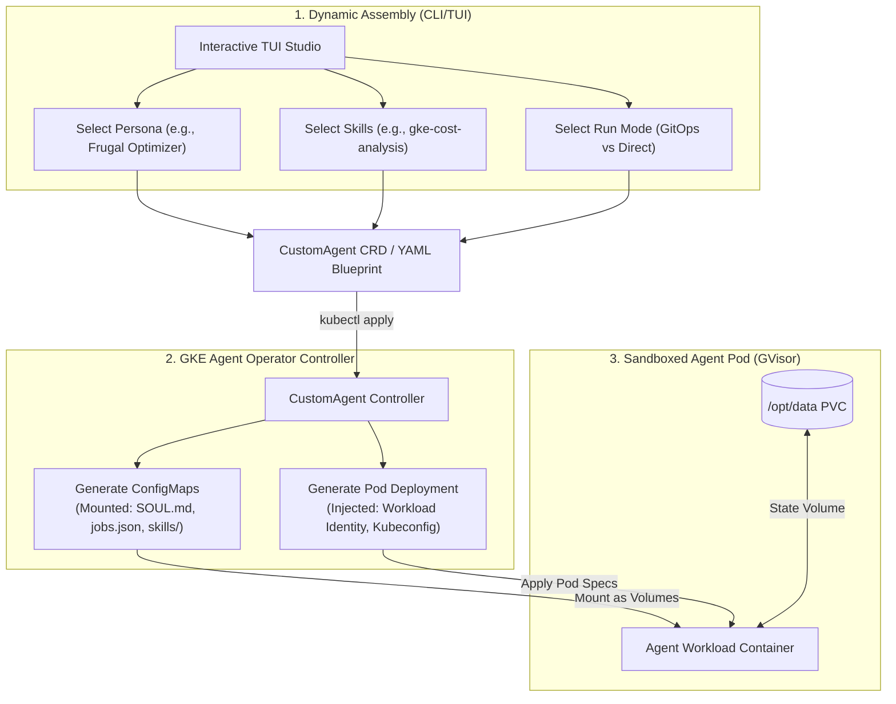

# GKE Agent Blueprints & Dynamic Assembly Specification

This document presents the architectural design for the **GKE Agent Blueprints & Dynamic Assembly Engine**. It details how we can structurally reorganize the `kube-agents` repository to transition from a rigid three-role layout into a fully composable, modular framework.

By utilizing our Go-based **Kubernetes Agent Operator** (`k8s-operator/`) and a proposed Go-based **Interactive CLI/TUI Agent Builder** (leveraging `bubbletea`), administrators and application teams can dynamically assemble, configure, and deploy highly specialized custom agent profiles on-the-fly.

---

## 1. Modular Repository Architecture

To achieve absolute flexibility, we decouple agent configurations into four distinct modular building blocks: **Personas**, **Skills**, **Procedures**, and **Schedules**. These components are mixed and matched dynamically by the CLI/TUI or the GKE Operator to compile a custom agent profile.

```
kube-agents/
├── k8s-operator/               # Go-based Kubernetes Agent Operator (Kubebuilder)
│   ├── api/v1alpha1/           # CRD Schemas (PlatformAgent, DevTeamAgent, OperatorAgent, CustomAgent)
│   └── internal/controller/    # Reconcilers deploying compiled ConfigMaps and Deployments
├── cli/                        # Go-based CLI/TUI Agent Builder (Bubble Tea)
│   ├── main.go                 # CLI/TUI entrypoint
│   └── pkg/tui/                # Interactive wizard components
├── personas/                   # Reusable SOUL.md & IDENTITY.md files (Aesthetics, tone, role focus)
│   ├── standard-operator/
│   ├── paranoid-security-auditor/
│   └── frugal-cost-optimizer/
├── skills/                     # Composable executable tools (MCP scripts, CLI wrappers, YAML modifiers)
│   ├── gke-cost-analysis/
│   ├── gke-workload-security/
│   └── gke-observability/
├── procedures/                 # Standard Operating Procedures (SOPs / markdown-driven reasoning guides)
│   ├── cve_scan_sop.md
│   └── weekly_cost_report_sop.md
└── templates/                  # Seed configs / default blueprints for one-click compilation
    ├── platform/
    ├── operator/
    └── devteam/
```

---

## 2. Dynamic Assembly Engine Design

Instead of deploying a container with a pre-baked, hardcoded persona, the Go operator and CLI-TUI compile an **Agent Profile Manifest**. The Kubernetes operator then dynamically provisions the agent Pod by mounting the selected blocks using a series of unified ConfigMaps and Secrets.



---

## 3. Resolving the 5 Friction Points via Native Dynamic Assembly

This dynamic blueprint model solves each of our core architectural bottlenecks natively inside the Kubernetes control plane:

### A. Persona & Role Rigidity $\rightarrow$ Composable Blueprints

Administrators can define a new agent role simply by creating a standard Kubernetes Custom Resource. The custom operator merges the selected Persona, Skills, and Procedures at startup:

```yaml
apiVersion: agent.gke.io/v1alpha1
kind: CustomAgent
metadata:
  name: cluster-cost-optimizer
  namespace: agent-system
spec:
  # 1. Base Identity
  personaRef:
    name: frugal-cost-optimizer
  # 2. Selectable Capabilities
  skills:
    - name: gke-cost-analysis
    - name: gke-compute-class-creator
  # 3. Attached Governance Procedures
  procedures:
    - name: weekly_cost_report_sop.md
  # 4. Target Operational Boundaries
  namespaces:
    - "app-frontend"
    - "app-backend"
  model:
    provider: "gemini"
    default: "gemini-1.5-pro"
```

---

### B. Monolithic Coupling $\rightarrow$ Isolated Standalone Manifests

Because each compiled blueprint is fully declared within its own namespaced CRD, any agent (e.g., `CustomAgent`, `DevTeamAgent`, `OperatorAgent`) can be deployed **standalone**. An SRE can deploy a single specialized cost-optimization agent in a target namespace without needing to spin up a centralized Platform Agent, Mesh Gateway, or LiteLLM service cluster.

---

### C. Restrictive Namespace Boundaries $\rightarrow$ Dynamic RBAC Injection

The Kubernetes Go Operator handles multi-namespace permissions dynamically. Based on the target `spec.namespaces` list defined in the agent's blueprint:

1. The operator automatically provisions a namespaced `ServiceAccount`.
2. It dynamically applies a `Role` and `RoleBinding` in _each_ target namespace (or a cluster-wide `ClusterRoleBinding` if wide scope is specified) granting minimal required RBAC to the agent's ServiceAccount.
3. The agent is instantly equipped to transition fluidly between namespaces without duplicate container deployments.

---

### D. GitOps Rigidity $\rightarrow$ Configurable Run Modes

We introduce a **Workflow Mode** attribute in the Agent Blueprint spec:

```yaml
spec:
  workflowMode: "Hybrid" # Options: GitOps, Direct, Hybrid
```

- **GitOps (Pure Declarative):** The agent runs its exclusive Pull Request workflow, pushing branches and opening PRs.
- **Direct (Break-Glass Override):** The agent runs with direct `kubectl apply` mutations, printing a distinct `[BREAK-GLASS]` flag and streaming fail-loud reconciliation audit logs to Cloud Logging.
- **Hybrid (Interactive Gate):** The agent prepares direct mutations, writes state to `.gemini-status.json` as `WAITING_FOR_APPROVAL`, and sends a notification with a diff-preview. The SRE can approve the change with a single CLI/TUI command (`kube-agent-cli approve <agent-name>`) to let the agent apply the change directly.

---

### E. Heavy Waking Costs $\rightarrow$ Local Pre-flight Screening Gates

Each skill block integrates a fast, non-cognitive **Pre-flight Screening Hook** (written in bash or Go). The agent container's cron engine runs this script first before waking the LLM:

```bash
#!/bin/bash
# Pre-flight Hook: skills/gke-cost-analysis/preflight.sh
# Performs rapid, non-cognitive cluster quota vs usage scan

drift_found=$(kubectl get deployment -n app-frontend -o json | jq -r '...detect_overprovisioning...')

if [ "$drift_found" = "false" ]; then
  # No actions needed. Exit silently without calling the LLM.
  exit 0
else
  # Out-of-sync or optimization found! Exit with code 1 to activate the cognitive completion.
  echo "OVERPROVISIONING_METRICS: $drift_found"
  exit 1
fi
```

- **Impact:** Reduces API billing costs by up to **90%** by keeping the LLM idle unless cognitive reasoning is strictly required.

---

## 4. Designing the Bubble Tea Interactive TUI Builder

To allow developers to assemble agent profiles with ease, we propose a Go-based **TUI Studio** (`kube-agent-cli`) built using the `bubbletea` framework. This interactive CLI provides a premium terminal-based wizard interface.

```
┌────────────────────────────────────────────────────────────────────────┐
│                      GKE AGENT ASSEMBLY STUDIO                         │
├────────────────────────────────────────────────────────────────────────┤
│                                                                        │
│  [1] Choose Persona Archetype                                          │
│      ○ Standard Operator (Calm, analytical infrastructure auditor)      │
│      ● Paranoid Security Auditor (Strict RBAC, networking scanner)     │
│      ○ Frugal Cost Optimizer (Resource right-sizing expert)            │
│                                                                        │
│  [2] Select Skills (Space to select)                                   │
│      [ ] gke-cost-analysis                                             │
│      [X] gke-workload-security                                         │
│      [X] gke-observability                                             │
│                                                                        │
│  [3] Set Target Scope                                                  │
│      Namespaces: app-frontend, app-backend, security-sandbox           │
│                                                                        │
│  [4] Select Workflow Mode                                              │
│      ● Hybrid (Approve direct mutations via TUI)                       │
│      ○ GitOps (Pull-Request only workflow)                             │
│      ○ Direct (Break-Glass immediate apply)                            │
│                                                                        │
├────────────────────────────────────────────────────────────────────────┤
│  [Enter] Compile Blueprint   [q] Exit Studio   [Tab] Next Section      │
└────────────────────────────────────────────────────────────────────────┘
```

### Core TUI Features:

- **Dynamic Checklist Renderer:** Reads the local `skills/` and `personas/` directories in real-time to populate the TUI selection menus.
- **Blueprint Compiler:** Merges the selected components into a clean Kubernetes Manifest (`CustomAgent` CRD).
- **One-Click Deployment Hub:** Integrates with the local `Kubeconfig` context, letting users deploy the compiled agent to the GKE cluster directly from the terminal with a single stroke.
- **Interactive Status Monitor:** Streams real-time updates from `.gemini-status.json` and allows humans to approve pending actions (`WAITING_FOR_APPROVAL`) using the TUI interface.

---

## 5. Implementation Roadmap

1.  **Repository Restructuring:** Create the shared `/personas/` and `procedures/` folders. Migrate existing hardcoded SOPs into discrete markdown files.
2.  **Go Operator CRD Expansion:** Introduce the `CustomAgent` Custom Resource Definition and controller inside `k8s-operator/` to handle dynamic ConfigMap compilation and multi-namespace RBAC injection.
3.  **TUI CLI Construction:** Build the `kube-agent-cli` terminal application under `cli/` using `bubbletea` and `lipgloss` for rich terminal rendering.
4.  **Pre-flight Hook Integration:** Update the container's entrypoint cron engine to run Skill pre-flight scripts, preventing expensive cognitive LLM invocations unless requested.
