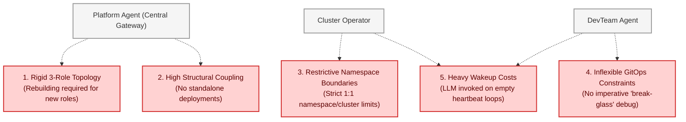

# Architectural Friction & Limitations in the Multi-Agent Harness

This document analyzes the core architectural friction points, bottlenecks, and scaling limitations identified in the initial **GKE Multi-Agent Cooperative Architecture Specification (`kube-agents`)**. While the three-role framework (`platform`, `operator`, `devteam`) provides a solid initial foundation for isolated, structured reconciliation, real-world fleet engineering reveals key structural constraints that hinder scalability, agility, and performance.

---

## 1. Summary of Architectural Bottlenecks

The existing GKE agentic harness operates under several rigid assumptions that impact deployment flexibility, resource utilization, and day-to-day operations:

---

## 2. Deep-Dive of the 5 Architectural Friction Points

### Friction 1: Rigid, Hardcoded Role Topologies

- **The Issue:** The architecture is locked into three predefined roles: Platform Agent, GKE Operator, and DevTeam.
- **Technical Bottleneck:** Adding a new specialized role (e.g., a `security-auditor` that runs CVE scans, a `db-migration-assistant` for database migrations, or a `cost-optimizer` focused on GKE billing export) is complex. It requires:
  1. Creating a custom Dockerfile or image layer.
  2. Editing `platform_mcp_server.py` to add custom registration logic and route parameters.
  3. Writing bespoke platform-agent routing rules.
- **Impact:** Development teams cannot dynamically declare or extend roles. The multi-agent topology is stagnant and cannot easily adapt to evolving operational needs.

---

### Friction 2: Monolithic Coupling (All-or-Nothing Deployments)

- **The Issue:** The member agents (`operator` and `devteam`) are tightly coupled to the central Platform Agent, Gateway, and GKE Config Connector infrastructure.
- **Technical Bottleneck:** There is no viable path to deploy a _standalone_ operator or developer agent in isolation. If an SRE wants to run an autonomous Operator Agent on a single, isolated cluster to monitor metrics without setting up a full Platform Agent, LiteLLM gateway, MCS, and OIDC tokens, they cannot easily do so.
- **Impact:** High barrier to entry. Teams are forced to adopt the entire heavy multi-agent framework even when they only need a single specialized agent for a targeted cluster-wide or namespace-wide task.

---

### Friction 3: Restrictive Single-Namespace Boundaries

- **The Issue:** A DevTeam Agent is strictly bound to a single cluster and a single namespace (`devteam-<cluster>-<location>-<namespace>`).
- **Technical Bottleneck:** Modern cloud-native microservices are rarely restricted to a single namespace. An application team often manages resources spread across:
  - Multiple namespaces within the same cluster (e.g., `frontend`, `backend`, `auth`, `logging`).
  - The same namespace cloned across separate environments/clusters (e.g., `staging` vs. `production`).
- **Impact:** Restricting an agent to a 1:1 namespace mapping forces teams to deploy, run, and pay for multiple duplicate DevTeam Agents to coordinate what is essentially a single unified application suite. This creates isolated cognitive silos and raises operational costs.

---

### Friction 4: Inflexible GitOps Constraints

- **The Issue:** The DevTeam Agent is strictly constrained to the **Exclusive PR Workflow**. It can only suggest modifications by checking out a git branch and opening a GitHub Pull Request. It is strictly prohibited from mutating Kubernetes resources directly.
- **Technical Bottleneck:** While GitOps is an industry best practice for stable, declarative deployments, it is highly restrictive during severe outages or emergencies. If a production system is failing due to a misconfigured ConfigMap or resource quota, forcing the DevTeam Agent to open a PR, wait for asynchronous human approval, and trigger a CI/CD pipeline creates unacceptable recovery latency (MTTR).
- **Impact:** No "break-glass" pathway exists for imperative troubleshooting, live debugging, or immediate service restoration. The agent is rendered helpless when rapid, direct intervention is required.

---

### Friction 5: High-Cost LLM Wakeups (Inefficient Heartbeats)

- **The Issue:** Automated operations rely on cron jobs (`jobs.json`) that wake up the agent via natural language prompts (e.g., _"Execute GKE blueprint alignment audit..."_).
- **Technical Bottleneck:** On every scheduled heartbeat, the system invokes the full LLM completion pipeline (LiteLLM, expensive reasoning chains, context windows) even when there is absolutely **no drift, no alerts, and no action required**.
- **Impact:**
  - **Inference Expense:** Hundreds of thousands of tokens are wasted daily to have an LLM read full SOP files only to conclude with "Everything is in sync."
  - **Performance Overhead:** Running high-latency reasoning loops on idle schedules consumes cluster CPU and memory, introducing unnecessary noise and performance drag.

---

## 3. Comparative Summary

| Dimension              | Current GKE Agentic Harness                 | Real-World Operational Need                              |
| :--------------------- | :------------------------------------------ | :------------------------------------------------------- |
| **Topology**           | Rigid, hardcoded 3-role layout              | Dynamic, on-demand specialized roles                     |
| **Deployment**         | Coupled to a centralized Platform Gateway   | Standalone, lightweight, decentralized runs              |
| **Operational Scope**  | Strict 1:1 namespace/cluster binding        | Fluid multi-namespace and multi-cluster visibility       |
| **Workflow**           | PR-Only GitOps (No manual overrides)        | Standard GitOps + Break-glass imperative troubleshooting |
| **Trigger Efficiency** | Prompt-driven waking on every cron interval | Pre-screened, script-driven selective LLM activation     |

---

> [!TIP]
> Resolving these friction points requires moving away from heavy, custom-orchestrated python servers and custom routing wrappers, and transitioning toward an open, containerized, and lightweight multi-agent orchestration framework.
>
> In the next document, [agent_scion_evolution.md](file:///home/user/projects/kube-agents/docs/agent_scion_evolution.md), we explore how standardizing our platform on the **Scion Containerized Orchestration Platform** solves each of these 5 friction points out of the box.
