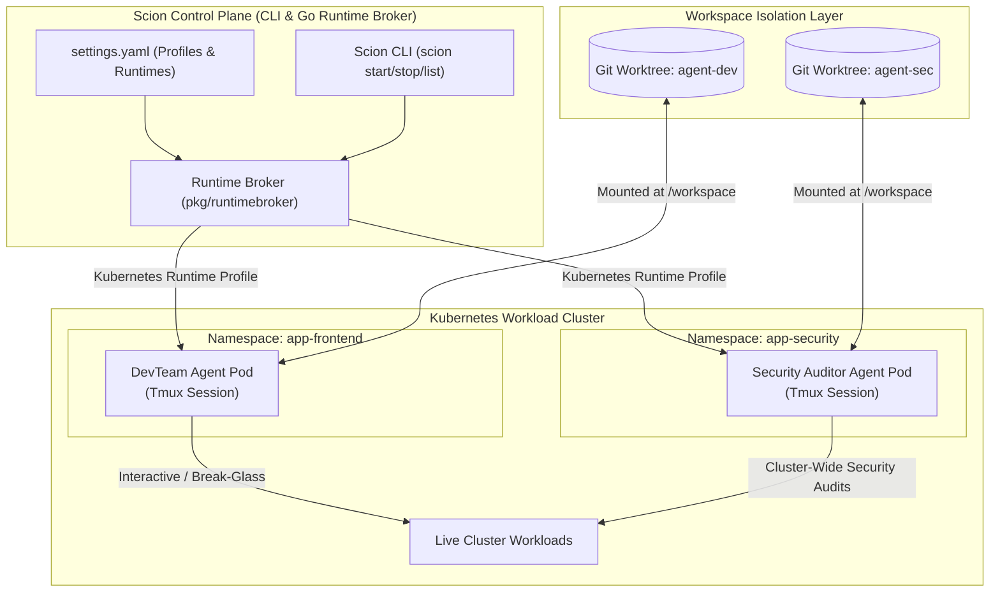

# GKE Multi-Agent Evolution: Standardizing on the Scion Platform

This document presents the **Target Evolution Specification** for standardizing our GKE Multi-Agent Harness on the **Scion** containerized orchestration platform (`../scion`). By replacing rigid, hardcoded Python platform servers and monolithic routing topologies with Scion's Go-based parallel runner, we transition to a highly modular, performant, and flexible agent infrastructure.

---

## 1. Evolution Architecture: Scion-Based Orchestration

Standardizing on Scion decouples the multi-agent system into declarative **Templates** running inside isolated container sandboxes managed by a unified, multi-runtime Go control plane.



---

## 2. Resolving the 5 Friction Points via Scion

Standardizing on the Scion framework directly resolves each of the architectural limitations identified in [agent_friction.md](file:///home/user/projects/kube-agents/docs/agent_friction.md).

### Resolution 1: Declarative and Dynamic Role Customization

- **The Scion Way:** Agent personas are defined as modular templates under `.scion/templates/` containing a `scion-agent.yaml` manifest. Adding or extending a role requires zero changes to the orchestrator code.
- **Implementation Example:** To deploy a new `security-auditor` role, we declare a custom template:

```yaml
# .scion/templates/security-auditor/scion-agent.yaml
schema_version: "1"
description: "Specialized Kubernetes and container vulnerability auditor"
agent_instructions: agents.md # Custom SOPs / rules for security scanning
system_prompt: system-prompt.md # Safety guardrails and scanning prompts
```

- **Dynamic Spawning:** A security auditor agent is instantly spawned on-demand using the Scion CLI:
  ```bash
  scion start cluster-security-auditor --template security-auditor "Audit namespace network policies for privilege escalation risks"
  ```

---

### Resolution 2: Decentralized, Standalone Agent Deployments

- **The Scion Way:** Scion natively operates in both **Solo/Local** mode and **Hosted** (Hub-Broker) mode. It does not require a monolithic central gateway, LiteLLM service, or complex MCS routing to run a single agent.
- **Flexible Runtimes:** The active profile in Scion's settings (`settings.yaml`) determines where the container runs. SREs can spin up standalone Operator or DevTeam agents locally on their laptops using Docker or directly in isolated namespaces on GKE.

```yaml
# ~/.scion/settings.yaml
schema_version: "1"
active_profile: remote-gke

runtimes:
  kubernetes:
    type: kubernetes
    context: "gke_myproject_us-central1_prod-cluster"
    namespace: "gke-operator-sandbox"

profiles:
  remote-gke:
    runtime: kubernetes
```

---

### Resolution 3: Multi-Namespace & Multi-Cluster Scope via Git Worktrees

- **The Scion Way:** Scion manages agent workspaces using isolated **Git Worktrees** (located under `../.scion_worktrees/`).
- **Decoupled Scope:** The agent is not hard-bound to its local running namespace. It operates on its dedicated git worktree (`/workspace`) and uses mounted GKE service account tokens or Kubernetes contexts to inspect or apply changes.
- **Multi-Scope Management:** A single DevTeam Agent can manage microservices across `frontend`, `backend`, and `auth` namespaces simultaneously because its operational scope is driven by its instructions and target Kubeconfig context rather than an immutable container name.

---

### Resolution 4: Hybrid GitOps and Break-Glass Interactive Troubleshooting

- **The Scion Way:** Scion agents run inside persistent `tmux` sessions. It balances strict declarative GitOps with imperative, human-in-the-loop troubleshooting.
- **The Lifecycle & Status Protocol:**
  1. The agent works on its task. Its real-time state is tracked inside `/home/gemini/.gemini-status.json` (e.g., `STARTING`, `THINKING`, `WAITING_FOR_INPUT`).
  2. During a cluster emergency or when manual confirmation is required, the agent transitions to `WAITING_FOR_INPUT`.
  3. An SRE can run `scion attach <agent-name>` to join the live `tmux` session, view terminal diagnostics, and perform "break-glass" imperative commands (e.g., `kubectl apply`, `kubectl port-forward`, manual config adjustments) in real-time.
  4. Once the crisis is resolved, the SRE detaches (`ctrl-b d`), and the agent resumes its automated reconciliation, ensuring absolute safety and observability.

---

### Resolution 5: Token-Saving Pre-screening Heartbeats

- **The Scion Way:** Instead of waking up heavy LLM completion pipelines via expensive natural language prompts on a fixed cron schedule, the Scion architecture standardizes on **lightweight pre-screening runner scripts**.
- **Pre-Screening Workflow:**
  1. A lightweight shell script or Go binary runs on a cron heartbeat.
  2. It executes optimized, non-AI operations (e.g., `git diff`, `kubectl diff`, or checking cluster health metrics) to check for drifts or anomalies.
  3. **Cognitive Activation:** If and only if a drift or health violation is detected, the script invokes the Scion CLI to spin up or message the agent:
     ```bash
     # Triggered only when a real drift is found in the backend configuration
     scion start backend-reconciler --template devteam "Drift detected in backend manifests. Reconcile workspace with git main branch."
     ```
  4. This prevents expensive idle wakeups, saving substantial LLM token consumption and eliminating computational noise on the cluster.

---

## 3. Comparison Matrix: Legacy vs. Scion Evolution

| Dimension                 | Legacy Python/FastMCP Harness                    | Scion Containerized Platform                                |
| :------------------------ | :----------------------------------------------- | :---------------------------------------------------------- |
| **Orchestration Core**    | Python/FastMCP stdio server and hardcoded routes | Go-based Cobra CLI (`scion`) & runtime brokers              |
| **Persona Provisioning**  | Manual Dockerfile edits & python registration    | Dynamic template directories with `scion-agent.yaml`        |
| **Execution Sandbox**     | Shared cluster namespace                         | Dedicated container per agent, with network isolation       |
| **Workspace Strategy**    | Local folders with simple git clones             | Dedicated isolated **Git Worktrees** per agent              |
| **Interactive Debugging** | Synchronous RPCs (no human-in-the-loop shell)    | Persistent `tmux` containers with `scion attach` capability |
| **Telemetry & State**     | Basic bearer token logs                          | Structured OpenTelemetry + `.gemini-status.json` states     |
| **Wakeup Economics**      | Raw LLM prompt-execution on every cron           | Script-driven pre-screening with on-demand agent activation |

---

> [!NOTE]
> Standardizing on the Scion platform provides a robust, future-proof blueprint for managing highly parallel, isolated, and cost-effective Kubernetes operations agents. This architecture eliminates systemic rigidity while preserving strict security boundaries.
