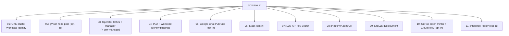

import { Aside, Steps } from "@astrojs/starlight/components";

The `./provision.sh` script bootstraps everything you need for a running Platform Agent on GKE: cluster, CRDs, IAM, secrets, Chat integration, inference gateway, and the token minter.

<Aside type="note">
  Prerequisites: a GCP project with billing enabled and `gcloud` authenticated.
  If you're starting from a fresh project, the provisioner creates the GKE
  cluster for you. You do **not** need to pre-install
  [cert-manager](/kube-agents/install/prerequisites/#cert-manager-on-the-target-cluster)
  — the operator step installs it automatically if it isn't already present.
</Aside>

## Run the provisioner

<Steps>

1. **Clone the repo.**

   ```bash
   git clone https://github.com/gke-labs/kube-agents.git
   cd kube-agents
   ```

2. **Run the provisioner.** The `gcp-provision` target lives in the operator's Makefile:

   ```bash
   cd k8s-operator
   make gcp-provision
   ```

   Or run the master script directly:

   ```bash
   cd k8s-operator/scripts
   ./provision.sh
   ```

   The first run is interactive: it prompts for the values it needs (project ID, region, cluster name, model provider and API key, agent permission set, and opt-in integrations such as Google Chat, Slack, and GitHub). Answers are cached in `k8s-operator/scripts/vars.sh` (git-ignored) so re-runs are non-interactive. Every sub-step is idempotent, so you can safely Ctrl-C and re-run.

3. **Configure Google Chat** (only if you enabled the Google Chat integration). In the [Chat API console](https://console.cloud.google.com/apis/api/chat.googleapis.com), point the bot's Pub/Sub connection at the topic created in step 5 (`projects/<PROJECT_ID>/topics/<CHAT_TOPIC_NAME>`). The provisioner prints the exact topic name and step-by-step instructions when it finishes.

4. **Verify.**

   ```bash
   kubectl get platformagents -n kubeagents-system
   kubectl get pods -n kubeagents-system
   ```

   You should see one `PlatformAgent` resource plus pods for the operator (`kubeagents-controller-manager`), the Platform Agent gateway (`platform-agent-gateway`), and LiteLLM (`litellm`). The GitHub token minter (`github-token-minter`) also appears if you enabled the GitHub integration. When the Platform Agent gateway pod is `Running` and Google Chat is configured, DM your Chat app and it should reply.

</Steps>

## What just happened

`./provision.sh` runs a sequence of modular sub-scripts. Each is idempotent, so re-running the master script skips work already done.



See [Provisioning scripts](/kube-agents/operator/provisioning-scripts/) for the per-script breakdown.

## Common flags and toggles

- `--dry-run` — prints what would be done without applying anything.
- `ENABLE_GVISOR=true` — provisions the gVisor sandbox node pool in step 2.
- `GOOGLE_CHAT_ENABLED=true` — configures the Google Chat Pub/Sub integration in step 5 (otherwise step 5 no-ops).
- `SLACK_ENABLED=true` — configures Slack tokens in step 6 (otherwise step 6 no-ops).
- `INFERENCE_REPLAY_ENABLED=true` — deploys the inference-replay proxy in step 11.

Set these as environment variables before running, or accept the interactive defaults.

## Uninstall

Run `make gcp-teardown` from `k8s-operator` (or `./teardown.sh` directly from `k8s-operator/scripts`) to run the sub-scripts in reverse order. See [Uninstall](/kube-agents/install/uninstall/) for the full procedure.

## Next steps

- [Concepts → Platform Agent](/kube-agents/concepts/platform-agent/) — what the agent's persona is doing and why.
- [Concepts → ChatOps](/kube-agents/concepts/chatops/) — how humans talk to it, and how proactive alerts come back.
- [Skill catalog](/kube-agents/skills/) — everything the agent can do out of the box.
