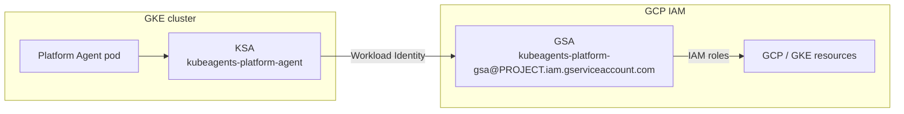

`kube-agents` separates two access planes that are easy to conflate:

- **GCP IAM** — what the agent's Google Service Account (GSA) can do at the Google Cloud control-plane level (create clusters, read monitoring, etc.). Selectable at provisioning time.
- **Kubernetes RBAC** — what the agent's Kubernetes ServiceAccount (KSA) can do against the cluster API. Always read-only, regardless of the GCP permission set.

Writes to running infrastructure never happen through the agent's own credentials — they route through the [declarative GitOps path](#secure-write-path-gitops).

## Identity model

The agent uses [GKE Workload Identity](https://cloud.google.com/kubernetes-engine/docs/how-to/workload-identity) to bind its in-cluster KSA to a GSA, so no static GCP key ever lands in the cluster.



The binding is pre-provisioned by [`provision_04_gcp_iam.sh`](https://github.com/gke-labs/kube-agents/blob/main/k8s-operator/scripts/provision_04_gcp_iam.sh), which annotates the KSA with `iam.gke.io/gcp-service-account: kubeagents-platform-gsa@<project>.iam.gserviceaccount.com`. The operator applies the same annotation from `spec.security` on the [`PlatformAgent` CR](/kube-agents/operator/platformagent-crd/).

## GCP IAM permission sets

`provision_04_gcp_iam.sh` grants the agent GSA one of three permission sets, chosen with the `PLATFORM_AGENT_PERMISSION_SET` variable (prompted during provisioning, cached in `vars.sh`):

| Permission set | `PLATFORM_AGENT_PERMISSION_SET` | Use it when                                                    |
| -------------- | ------------------------------- | -------------------------------------------------------------- |
| **gke-admin**  | `gke-admin` (default)           | The agent should manage GKE lifecycle and node pools directly. |
| **read-only**  | `read-only`                     | Auditing / monitoring only — no GCP write capability.          |
| **custom**     | `custom`                        | You bind roles yourself and skip the built-in grants.          |

### Roles per set

The default **gke-admin** set binds:

- `roles/container.clusterAdmin`, `roles/container.admin` — full GKE control.
- `roles/monitoring.admin` — manage monitoring configuration.
- `roles/logging.viewer` — read logs only (the agent must **not** administer the audit-log sink).
- `roles/iam.serviceAccountUser` — act as service accounts when running jobs.
- `roles/iam.securityReviewer` — read IAM policy for review.
- `roles/mcp.toolUser` — call the GKE MCP server.

The **read-only** set swaps the admin roles for viewers:

- `roles/container.clusterViewer`, `roles/container.viewer` — read-only GKE.
- `roles/monitoring.viewer`, `roles/logging.viewer` — read-only telemetry.
- `roles/iam.serviceAccountUser`, `roles/iam.securityReviewer`, `roles/mcp.toolUser` — unchanged.

The **custom** set binds nothing automatically; grant roles to the GSA yourself.

## Kubernetes RBAC

Independently of the GCP permission set, the operator grants the agent KSA a **read-only** footprint on the Kubernetes API. It creates two bindings (see [`platformagent_manifests.go`](https://github.com/gke-labs/kube-agents/blob/main/k8s-operator/internal/controller/platformagent_manifests.go)):

| Binding                                  | Role                         | Grants                                                            |
| ---------------------------------------- | ---------------------------- | ----------------------------------------------------------------- |
| `kubeagents:viewer:<namespace>:<name>`   | standard `view` ClusterRole  | Read access to most namespaced resources — **excluding Secrets**. |
| `kubeagents:explorer:<namespace>:<name>` | custom `kubeagents:explorer` | `get`/`list` on `nodes`, `pods`, `namespaces`, and CRDs.          |

For the default CR (`platform-agent` in `kubeagents-system`) the bindings resolve to `kubeagents:viewer:kubeagents-system:platform-agent` and `kubeagents:explorer:kubeagents-system:platform-agent`.

Neither role carries any write verb (`create`, `update`, `patch`, `delete`), and neither can read Secrets. The agent cannot modify Deployments, Services, or namespaces directly, and it cannot read Secret values — if a resource it proposes needs a Secret, it references the Secret by name rather than reading its contents.

Verify the bindings on a running cluster:

```bash
kubectl describe clusterrolebinding kubeagents:viewer:kubeagents-system:platform-agent
kubectl describe clusterrolebinding kubeagents:explorer:kubeagents-system:platform-agent
```

## Configuring read-only (auditing) mode

To run the agent purely for auditing, monitoring, and trend analysis:

**With the provisioner (recommended)** — select the `read-only` permission set when `provision_04_gcp_iam.sh` prompts, or set it up front:

```bash
cd k8s-operator/scripts
PLATFORM_AGENT_PERMISSION_SET=read-only ./provision_04_gcp_iam.sh
```

**On an existing GSA** — swap the admin roles for viewers by hand:

```bash
PROJECT_ID="your-gcp-project-id"
GSA_EMAIL="kubeagents-platform-gsa@${PROJECT_ID}.iam.gserviceaccount.com"

# Remove the admin roles
for role in roles/container.clusterAdmin roles/container.admin roles/monitoring.admin; do
  gcloud projects remove-iam-policy-binding "${PROJECT_ID}" \
    --member="serviceAccount:${GSA_EMAIL}" --role="${role}"
done

# Add the read-only roles
for role in roles/container.clusterViewer roles/container.viewer roles/monitoring.viewer; do
  gcloud projects add-iam-policy-binding "${PROJECT_ID}" \
    --member="serviceAccount:${GSA_EMAIL}" --role="${role}"
done
```

Leave `roles/logging.viewer`, `roles/iam.serviceAccountUser`, `roles/iam.securityReviewer`, and `roles/mcp.toolUser` in place — they are shared by both sets.

The Kubernetes RBAC above is already read-only in every mode, so no cluster-side change is needed.

## Secure write path: GitOps

Because the agent's Kubernetes RBAC is read-only, remediations are proposed rather than applied:

1. The agent invokes the [`submit-suggestion`](/kube-agents/concepts/declarative-workflow/) skill with a proposed diff (usually a YAML patch from a governance SOP).
2. `submit-suggestion` commits to a topic branch and calls [Minty](/kube-agents/deploy/token-minter/) for a short-lived GitHub App token.
3. It opens a Pull Request against your GitOps repository.
4. A human reviews and merges; a GitOps controller (Argo CD, Flux) reconciles the change into the cluster.

The agent never has direct write access to running infrastructure — see [Declarative workflow](/kube-agents/concepts/declarative-workflow/).

## Change control & safety

- **No direct cluster writes.** Enforced by RBAC (above) and by the persona's automation-first stance — the agent does not `kubectl apply`; it opens PRs. See [Platform Agent](/kube-agents/concepts/platform-agent/).
- **One agent per project.** The admission webhook rejects a second `PlatformAgent` CR, so a cluster can't accumulate agents with overlapping scope. See [PlatformAgent CRD](/kube-agents/operator/platformagent-crd/).
- **Human sign-off for destructive ops.** Cluster deletion, tenant offboarding, and broad IAM revocation always require explicit human approval, regardless of any "just do it" phrasing.
- **Bounded recovery.** The agent retries a blocker through its recovery ladder (roughly five iterations or ~10 minutes) before escalating to a human instead of looping indefinitely.
- **Read-only log access by default.** Provisioning grants the agent `roles/logging.viewer`, not admin — it cannot tamper with the audit-log sink. Stronger environments should route an immutable log copy to a separate security project (see [User attribution](/kube-agents/reference/attribution/#trust-boundary)).

## Where to go next

- [Platform Agent](/kube-agents/concepts/platform-agent/) — the persona and least-privilege stance.
- [PlatformAgent CRD](/kube-agents/operator/platformagent-crd/) — `spec.security` and the permission set field.
- [User attribution](/kube-agents/reference/attribution/) — tracing an action back to the human who requested it.
- [Provisioning scripts](/kube-agents/operator/provisioning-scripts/) — where the IAM and RBAC are laid down.
